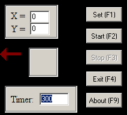

MouseClick
==========

This program is written and compiled with the Borland C++ Builder 6

## Creator

**Stefan Hüsges**

* [GitHub][1]
* [Homepage][2]
 
## Screenshot

## Shortcuts

* F1 - position set
* F2 - start timer
* F3 - stop timer
* F4 - exit program
* Ctrl + L - left click mode
* Ctrl + R - right click mode
* Ctrl + K - keyboard mode

## License
[][3]

[1]: https://github.com/tronsha
[2]: http://www.mpcx.net
[3]: http://www.gnu.org/licenses/gpl-3.0
